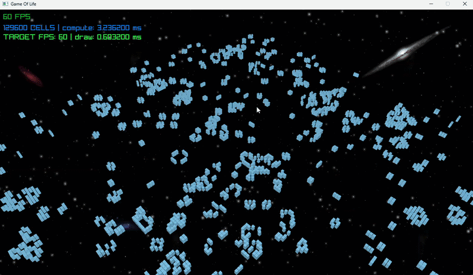
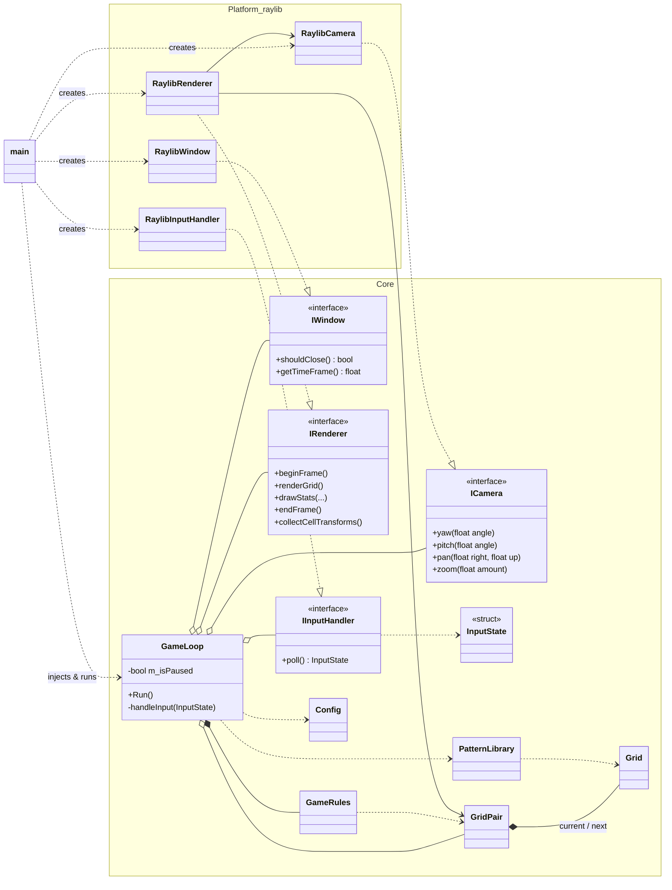

# Game of Life 3D

Conway's Game of Life extended to three dimensions, written in C++20 and rendered with [raylib](https://www.raylib.com/).

<!-- TODO: add demo GIF, e.g.
<p align="center">
  
</p>
-->

## About

Each cell lives in a 3D grid and has 26 neighbours (the Moore neighbourhood). Birth and survival follow a configurable rule. The default is **B6/S567**: a dead cell with 6 live neighbours is born, and a live cell with 5 to 7 live neighbours survives.

- Flat, contiguous grid with guard cells and precomputed neighbour offsets, so the update loop needs no bounds checks.
- Double-buffered simulation stepped at a fixed interval, separate from the frame rate.
- All live cells drawn in a single instanced draw call with a custom GLSL shader.
- Orbit camera that you control with the mouse only.

## An intentionally over-engineered architecture

This project is also a learning exercise. The goal is to apply **SOLID principles** and keep the core **fully independent of the graphics library**.

For a program this small that is overkill, and that's on purpose. A small codebase makes it easy to see how each principle changes the design.

- **Dependency Inversion.** `GameLoop` only knows the abstract interfaces `IWindow`, `IRenderer`, `IInputHandler` and `ICamera`. The raylib implementations are created in `main.cpp`, the composition root, and injected.
- **Single Responsibility.** Each class has one job. For example, the input handler only turns raw mouse and keyboard events into a platform-agnostic `InputState`. Game state such as pause, and what to do with the input, belong to `GameLoop`.
- **Interface Segregation.** Interfaces are small and focused. `ICamera`, for example, only exposes `yaw`, `pitch`, `pan` and `zoom`.
- **Open/Closed and Liskov Substitution.** A different backend (another graphics library, or a headless one for tests) can be plugged in by writing new implementations, without touching the core.

The separation is **enforced by the build**. The core is a separate static library (`gol_core`) that does not link raylib, so any raylib include in the core fails to compile.

The refactoring is still in progress, so some parts are not fully "SOLID" yet.

## Class diagram



## Controls

| Input               | Action                          |
| ------------------- | ------------------------------- |
| Left mouse + drag   | Orbit around the target         |
| Right mouse + drag  | Pan                             |
| Mouse wheel         | Zoom in / out                   |
| `P`                 | Pause / resume the simulation   |

## Build and run

Requirements: CMake 3.15+ and a C++20 compiler. raylib 6.0 and GoogleTest are downloaded automatically by CMake `FetchContent`, so the first configure needs an internet connection.

```sh
cmake -S . -B build -DCMAKE_BUILD_TYPE=Release
cmake --build build
```

Run the executable from its own folder. Shaders and textures are copied next to it at build time and loaded with relative paths.

```sh
cd build
./gameOfLife3D
```

Tests are built by default. Run them with `ctest --test-dir build`, or turn them off with `-DBUILD_TESTS=OFF`.

## Configuration

The grid size, initial pattern, birth/survival rule and generation interval are compile-time constants in [`include/core/Config.h`](include/core/Config.h). Other rule sets are included there, commented out.

## Project structure

```
include/core/      core interfaces and simulation (no raylib)
include/platform/  raylib implementations of the core interfaces
src/core/          -> gol_core library
src/platform/      -> gol_platform library
resources/         shaders and textures
tests/             GoogleTest unit tests
main.cpp           composition root
```
