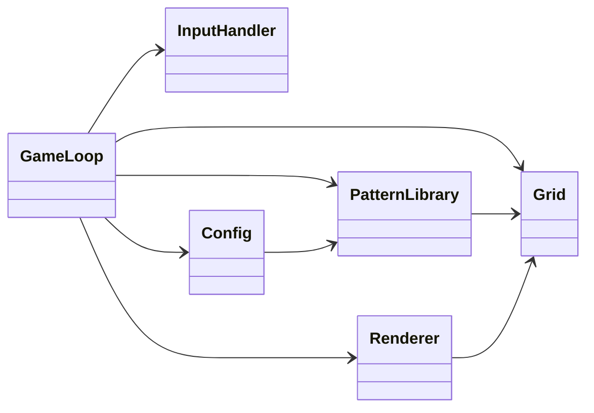
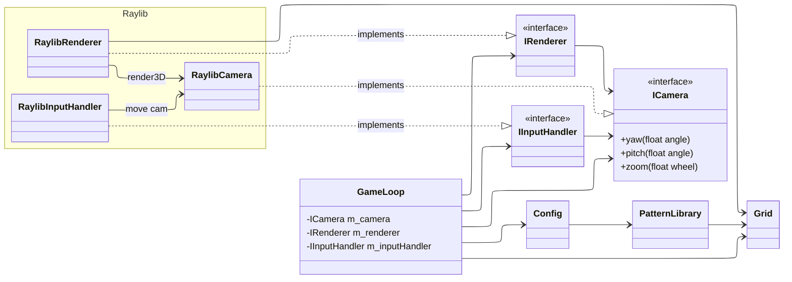

```mermaid
classDiagram
    direction LR

    class GameLoop
    class Grid
    class PatternLibrary
    class InputHandler
    class Renderer
    class Config

    GameLoop --> Grid
    GameLoop --> Renderer
    GameLoop --> PatternLibrary
    GameLoop --> InputHandler
    GameLoop --> Config
    Config --> PatternLibrary
    PatternLibrary --> Grid
    Renderer --> Grid
```

%% === Proposed SOLID architecture decoupled from raylib ===

```mermaid
---
config:
  layout: elk
---
classDiagram
    direction LR

    class GameLoop {
        -ICamera m_camera
        -IRenderer m_renderer
        -IInputHandler m_inputHandler
    }
    class IRenderer {
        <<interface>>
    }
    class IInputHandler {
        <<interface>>
    }
    class ICamera {
        <<interface>>
        +yaw(float angle)
        +pitch(float angle)
        +zoom(float wheel)
    }

    class Grid
    class PatternLibrary
    class Config

    namespace Raylib {
        class RaylibRenderer
        class RaylibInputHandler
        class RaylibCamera
    }

    GameLoop --> IRenderer
    GameLoop --> IInputHandler
    GameLoop --> ICamera
    GameLoop --> Config
    GameLoop --> Grid

    RaylibRenderer ..|> IRenderer : implements
    RaylibInputHandler ..|> IInputHandler : implements
    RaylibCamera ..|> ICamera : implements

    RaylibRenderer --> Grid
    RaylibRenderer --> RaylibCamera: render3D
    RaylibInputHandler --> RaylibCamera: move cam

    IRenderer --> ICamera
    IInputHandler --> ICamera

    Config --> PatternLibrary
    PatternLibrary --> Grid

    classDef interface fill:#eef2ff,stroke:#818cf8,stroke-width:2px,color:#1e1b4b
    cssClass "IRenderer,IInputHandler,ICamera" interface
```