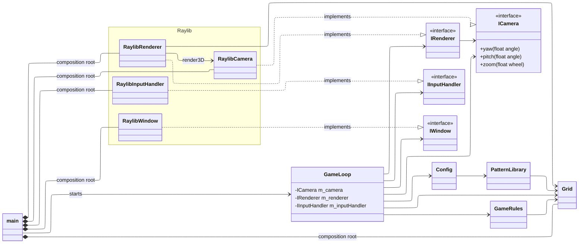

```mermaid
---
config:
  layout: elk
---
classDiagram
    direction LR

    class main

    class GameLoop {
        -ICamera m_camera
        -IRenderer m_renderer
        -IInputHandler m_inputHandler
    }
    class IRenderer {
        <<interface>>
    }
    class IInputHandler {
        <<interface>>
    }
    class IWindow {
        <<interface>>
    }
    class ICamera {
        <<interface>>
        +yaw(float angle)
        +pitch(float angle)
        +zoom(float wheel)
    }

    class Grid
    class PatternLibrary
    class Config
    class GameRules


    namespace Raylib {
        class RaylibRenderer
        class RaylibInputHandler
        class RaylibCamera
        class RaylibWindow
    }

    main *-- RaylibRenderer : composition root
    main *-- RaylibInputHandler : composition root
    main *-- RaylibCamera : composition root
    main *-- RaylibWindow : composition root
    main *-- Grid : composition root
    main --> GameLoop : starts

    GameLoop --> IRenderer
    GameLoop --> IInputHandler
    GameLoop --> ICamera
    GameLoop --> IWindow
    GameLoop --> Config
    GameLoop --> Grid
    GameLoop --> GameRules
    GameRules --> Grid


    RaylibRenderer ..|> IRenderer : implements
    RaylibInputHandler ..|> IInputHandler : implements
    RaylibCamera ..|> ICamera : implements
    RaylibWindow ..|> IWindow : implements

    RaylibRenderer --> Grid
    RaylibRenderer --> RaylibCamera: render3D

    IRenderer --> ICamera

    Config --> PatternLibrary
    PatternLibrary --> Grid

    classDef interface fill:#eef2ff,stroke:#818cf8,stroke-width:2px,color:#1e1b4b
    cssClass "IRenderer,IInputHandler,ICamera" interface
```